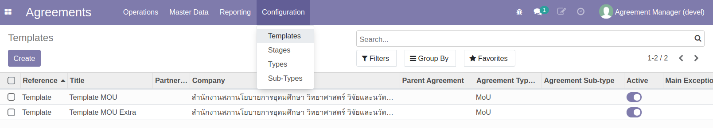
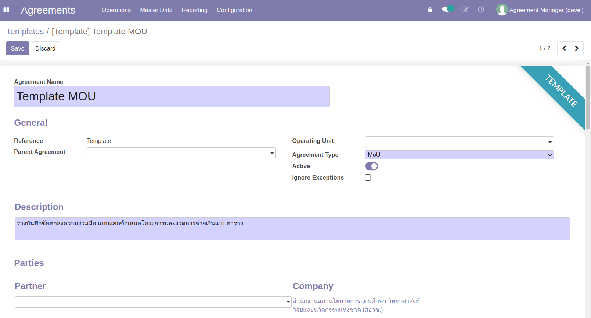
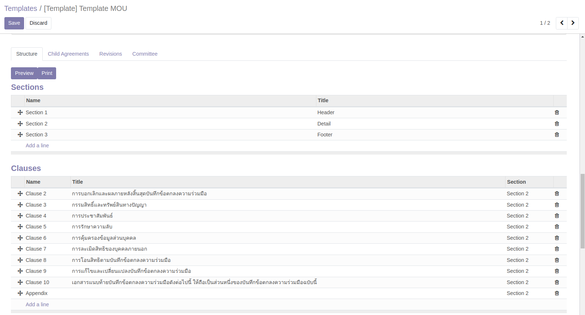
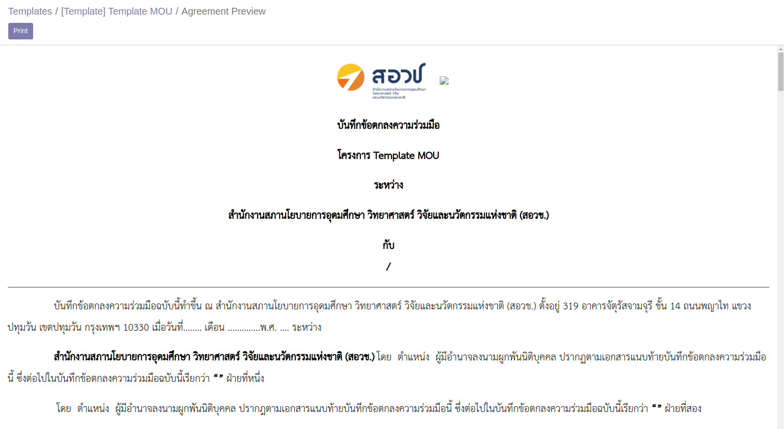
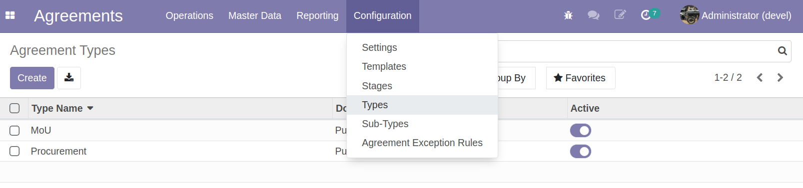

# Master Data

## Agreement Template

Agreement Template คือตัวอย่างร่างเอกสารสัญญา ซึ่งประกอบด้วยเนื้อหาของสัญญา (เช่น Section, Caluse, Appendix) โดยปัจจุบันได้มีการเตรียม Template แบบมาตรฐานให้ 2 แบบคือ แบบทั่วไป (Template MOU) และแบบเพิ่มเติม (Template MOU Extra) ทั้งสองแบบใช้ได้ทั้งกับกรณีมีเงินงบประมาณและไม่มีเงินงบประมาณมาเกี่ยวข้อง เมื่อมีการสร้าง MOU ตัวจริงจาก Template นี้ ผู้ใช้งานจะต้องเพิ่ม/ลดข้อมูลตามที่ใช้จริงเอง และเลือกว่าต้องการแบบมีเงินหรือไม่มีเงินงบประมาณ (Has Budget?)

**Menu:** Agreement > Configuration > Templates

1. ตัวอย่าง Template ปัจจุบัน (สามารถเพิ่มเติมได้)

   

   

2. เนื้อหาสำคัญที่ใช้สร้างเป็นแบบร่างสัญญา คือส่วน Section, Clause และ Appendix

   

3. ผู้ใช้งานสามารถกดปุ่ม Preview หรือ Print เพื่อดูตัวอย่างการปรินท์ได้

   

::: warning
ผู้สร้าง Template ควรต้องมีความรู้ด้านข้อมูลของระบบ และภาษา html เบื้องต้น เพราะเป็นภาษาเบื้องหลังของการสร้าง Template
:::

## Agreement Type

แบ่งประเภทของ Agreement ปัจจุบันมีเพียง 2 ประเภทคือ

1. MoU: สำหรับ Template ที่เกี่ยวกับ MoU (เกี่ยวข้องกับเนื้อหาในบทนี้)
2. Procurement: สำหรับ Template ที่ใช้สร้าง Agreement สำหรับกระบวนการจัดซื้อ (ไม่เกี่ยวกับบทนี้)

**Menu:** Agreement > Configuration > Types

::: warning
Agreement Type นี้ตั้งค่ามาสำหรับ NxPO โดยเฉพาะแล้ว ไม่ต้องเปลี่ยนแปลง
:::
