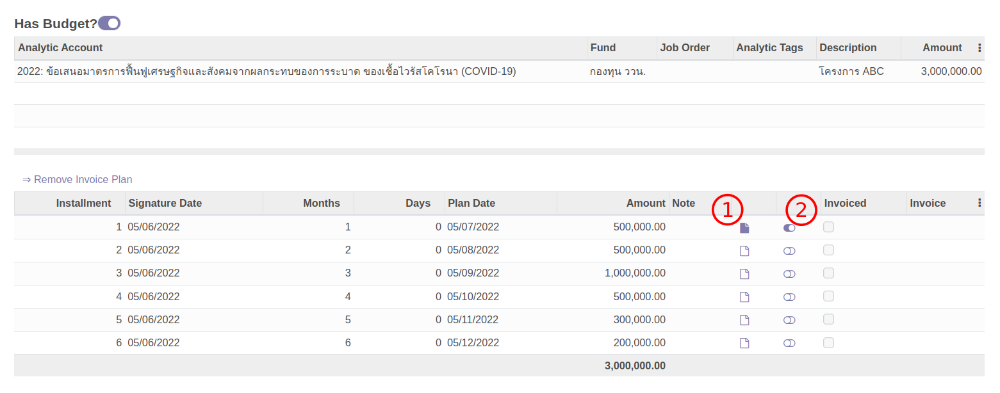
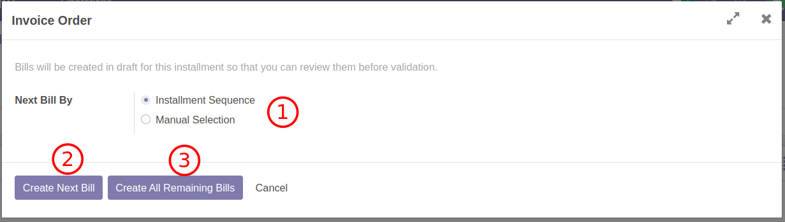
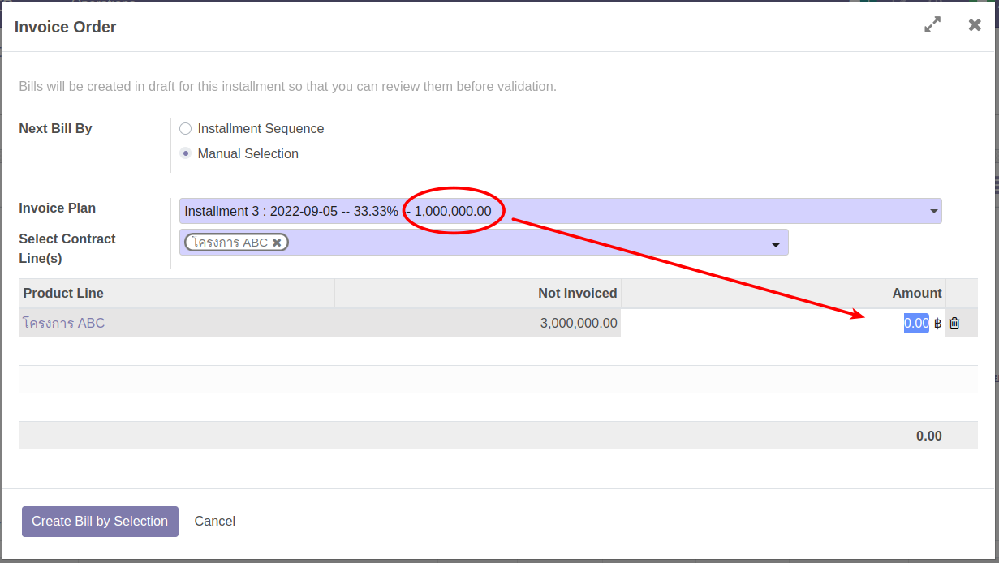
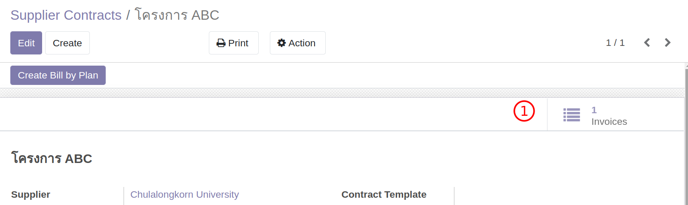

# จ่ายเงินตามงวด

**Menu:** Agreement > Operations > MOU Agreement

เอกสารตั้งต้นของการจ่ายเงินคือ Contract ซึ่งถูกสร้างไว้แล้วในขั้นตอนการจองเงิน แต่ผู้ที่ทำหน้าที่ออก Vendor Bill และจ่ายเงินคือแผนกการเงิน

แต่ก่อนที่ฝ่ายการเงินจำดำเนินการทางการเงินได้จริง ในทางปฏิบัติต้องได้รับแจ้งจากเจ้าของ MOU เสียก่อนดังจะได้อธิบายต่อไป

## สำหรับ ผู้ใช้งาน

### แจ้งฝ่ายการเงินถึงงวดงานที่สามารถทำจ่ายได้

1. ไปที่เมนู Agreement และเปิด MOU ที่ต้องการ
2. ที่ตาราง Invoice Plan ผู้ใช้งานทำการแจ้งฝ่ายการเงิน โดยการ

   

   1. แนบเอกสารหลักฐานที่เกี่ยวข้องกับการส่งมอบ
   2. เปิดสวิตช์เพื่อเป็นการแจ้งให้การเงินทราบ

## สำหรับ ฝ่ายการเงิน

### ดำเนินการออก Bill เพื่อจ่ายเงิน

1. ไปที่เมนู Agreement และเปิด MOU ที่ต้องการ
2. คลิกที่ Icon Contract ด้านบนของเอกสารเพื่อเปิด Contract และไปที่ tab Invoice Plan ของ Contract

   

   1. จะเห็นได้รายการที่ทางผู้ใช้งานแจ้งให้ดำเนินการสอดคล้องกับที่ MOU
   2. จะเห็นปุ่ม Create Bill by Plan

   **Note:** ตามรูป การเงินควรสร้างเฉพาะงวดที่ 1 เท่านั้น แต่จะขออธิบายการทำงานทั่วๆไป

3. คลิกที่ปุ่ม Create Bill by Plan เพื่อสร้าง Vendor Bill

   

   1. สร้าง Bill โดย (1) ตามลำดับใน Invoice Plan หรือ (2) เลือกเอง
   2. สร้าง Bill ถัดไป (สร้างทีละ Bill)
   3. สร้างทุก Bill ที่เหลือให้สร้าง

4. ถ้าเลือกสร้าง Bill โดยวิธีที่ (2) เลือกเอง (Manual Selection) ผู้ใช้งานจะสามารถสร้าง Bill ได้ยืดหยุ่นกว่า โดยจะเลือกข้ามงวด และเลือกใส่เงินด้วยตัวเอง (ระบบจะเพียงเตือนหากยอดเงินไม่เท่ากับที่วางแผน แต่ไม่ห้าม)

   

5. หลังจากนั้น Bill ที่ถูกสร้างขึ้น (Draft) ฝ่ายการเงินสามารถคลิกเข้าไปดู และดำเนินการจ่ายได้ตามขั้นตอนการเงินปกติ

   

End.
