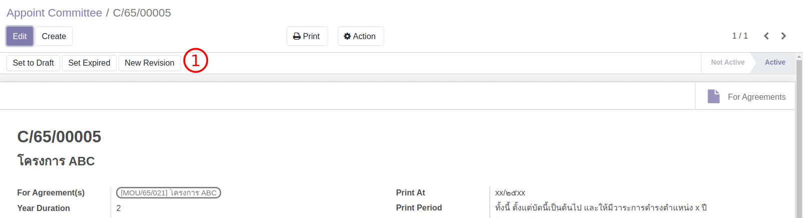
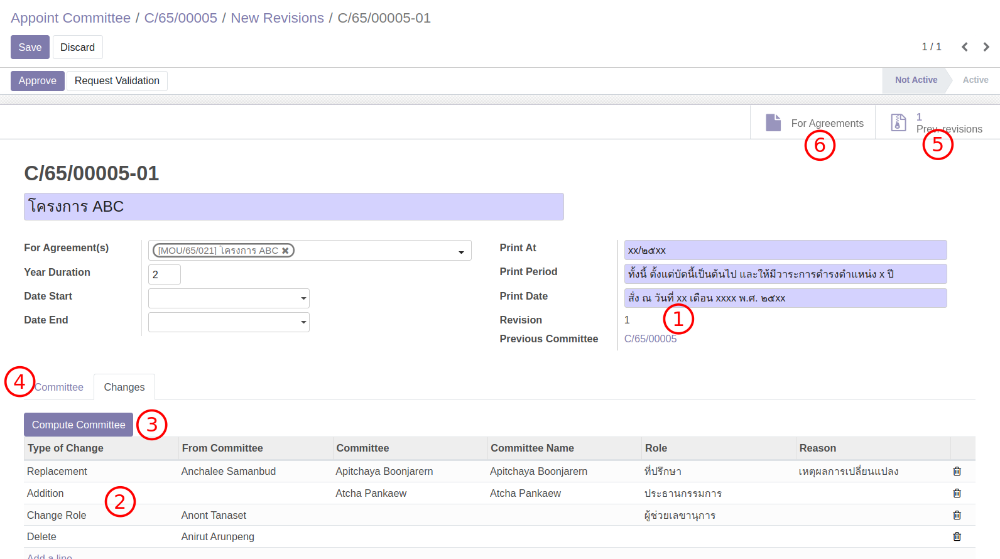

# แก้ไขเปลี่ยนแปลง Committee (คณะกรรมการ)

**Menu:** Agreement > Operations > Committee

สำหรับกรณีที่มีการปรับเปลี่ยนคณะกรรมการแต่ละชุด เช่น เพิ่มเติม ลาออก เปลี่ยนบทบาทหน้าที่
จะมีการทำเรื่องขอเปลี่ยนคณะกรรมการจากนอกระบบ แต่ในระบบต้องมีการปรับข้อมูลให้เป็นปัจจุบันเช่นกัน

## สำหรับ ผู้ใช้งาน

### สร้าง Revision ใหม่

1. ไปที่เมนู Committee และค้นหา Committee ที่ต้องการเปลี่ยนแปลง
2. กดปุ่ม New Revision ระบบจะสร้าง Version ใหม่ (และซ่อน version เดิม)

   

3. ที่ Committee Version ใหม่ ทำการเปลี่ยนแปลงข้อมูล

   

   1. Version ปรับใหม่ แต่ยังมี link ไปหา version เก่า
   2. ที่ tab Changes ผู้ใช้งานสามารถทำการเปลี่ยนแปลงได้ 4 แบบ

      - Replacement: เปลี่ยนคน
      - Addition: เพิ่มคน
      - Change Role: เปลี่ยนบทบาทของคนเดิม
      - Delete: ลบคน

   3. กดปุ่ม Compute ระบบจะทำการปรับปรุงกรรมการชุดเดิมเป็นชุดใหม่
   4. เปิด tab Committee เพื่อดูการเปลี่ยนแปลง
   5. ดู version ก่อนหน้า
   6. Link ไปยัง Agreement/MOU ที่กำกับดูแล

4. กดปุ่ม Request Validation เพื่อส่งอนุมัติใหม่

End.
