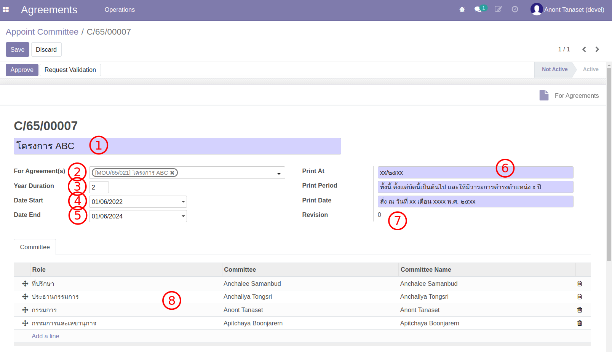
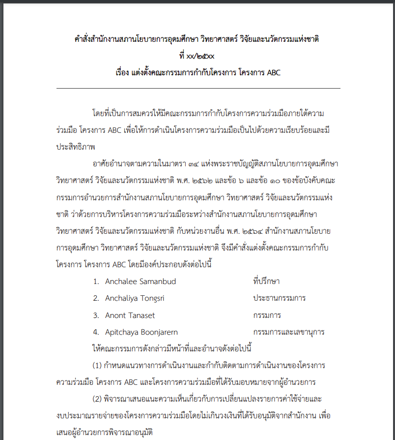
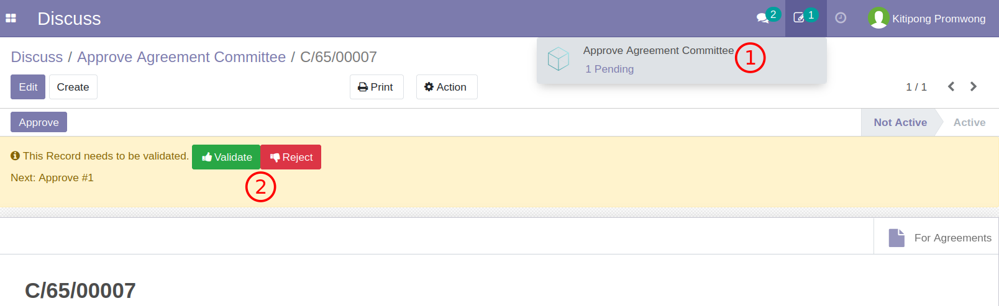
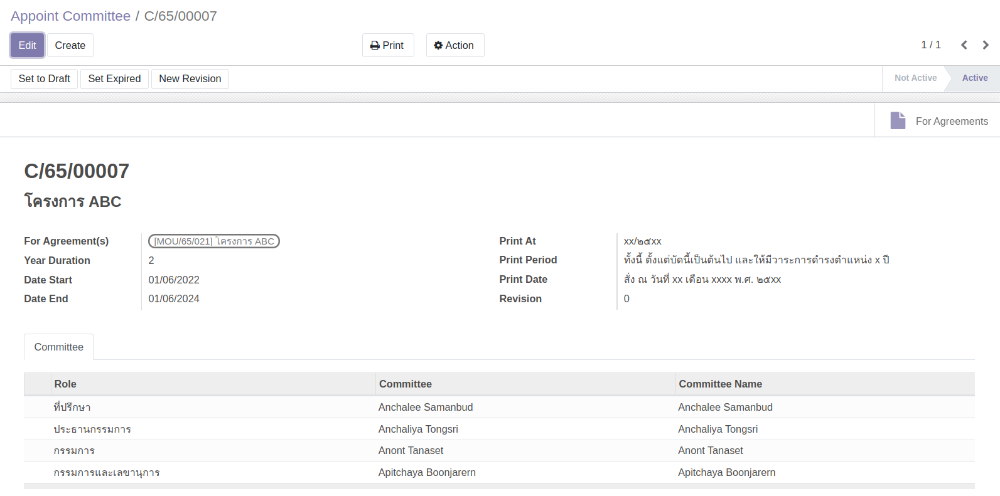
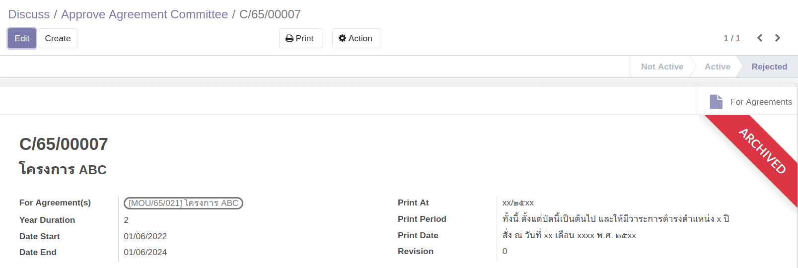

# แต่งตั้ง Committee (คณะกรรมการ)

**Menu:** Agreement > Operations > Committee

การสร้าง Committee สามารถสร้างได้จาก 2 ช่องทาง

1. สร้างจาก Agreement โดยกดปุ่ม Create Committee (เฉพาะสำหรับ MOU ที่ยังไม่มี Committee และต้องการ Committee ชุดใหม่)
2. สร้างจากเมนู Committee

## สำหรับ ผู้ใช้งาน

### สร้าง Committee

1. ไปที่เมนู Committee
2. กดปุ่ม Create เพื่อสร้าง Committee ใหม่

   

   1. ชื่อโครงการ (กรณีสร้างจาก Agreement ระบบจะผ่านชื่อโครงการ MOU มาให้)
   2. เลือก Agreement/MOU ที่กรรมชุดนี้ดูแล (เลือกได้มากกว่า 1 MOU แต่ต้องเป็น MOU ที่ยังไม่มี Committee)
   3. ระยะเวลาการทำงานของ Committee (ปกติ 2 ปี)
   4. วันเริ่มต้น
   5. วันสิ้นสุด (ระบบคำนวนให้)
   6. ข้อความที่ออกในการ Print Form แต่งตั้ง
   7. Revision
   8. รายชื่อคณะกรรมการ

3. กดปุ่ม Print > Agreement Committee Form เพื่อตรวจสอบเอกสารแต่งตั้ง

   

4. กดปุ่ม Request Validation เพื่อส่งอนุมัติ

## สำหรับ ผู้อนุมัติ

### อนุมัติ Committee

1. ผู้อนุมัติ ทำการอนุมัติ/ไม่อนุมัติ เอกสารแต่งตั้ง Committee

   

   1. ผู้อนุมัติจะเห็นรายการเอกสารที่ถูกขอ
   2. เมื่อเปิดเอกสารจะเห็นปุ่ม อนุมัติและไม่อนุมัติ (Validate / Reject)
   3. เมื่อกดปุ่มระบบจะเปิด Wizard เพื่อให้ผู้อนุมติกรอกข้อความก่อนยืนยัน

2. เอกสารที่ได้รับการอนุมัติ สถานะเปลี่ยนเป็น Active

   

3. เอกสารที่ไม่ได้รับการอนุมัติ สถานะเปลี่ยนเป็น Rejected

   
