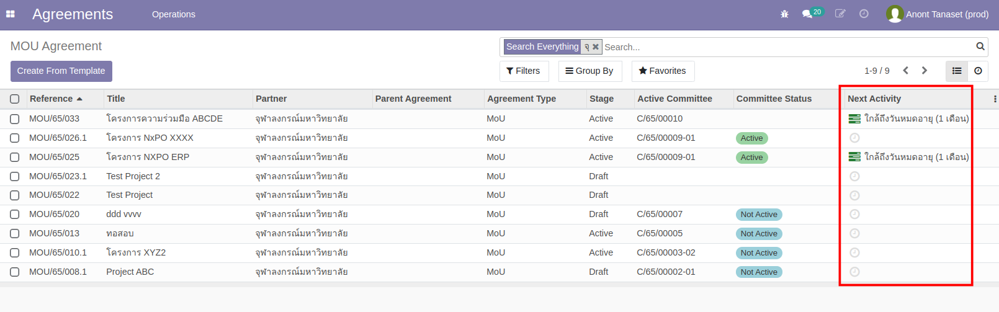
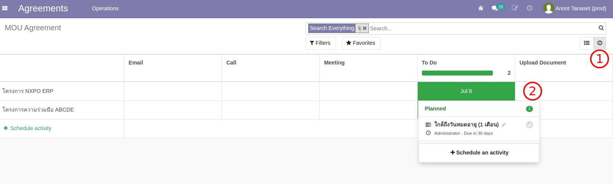
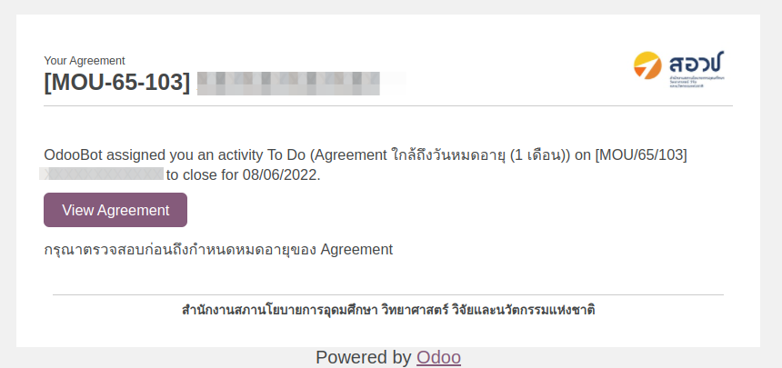
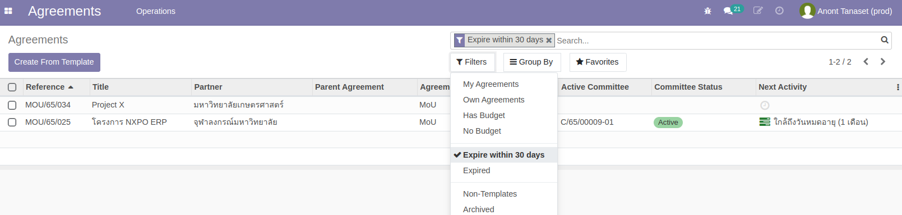

# MOU หมดอายุ

**Menu:** Agreement > Operations > MOU Agreement

## การแจ้งเตือน

สำหรับ MOU ที่ใกล้ถึงกำหนดวันสิ้นสุดใน 1 เดือน (End Date) ระบบจะมีการสร้างข้อความเตือน (Scheduled Activity) บนรายการที่ถึงกำหนด โดยดูได้จาก

1. Agreement Tree View

2. Agreement Activity View

3. Email

## การกรองเอกสารที่หมดอายุ

ผู้ใช้งานยังสามารถค้นหารายการที่หมดอายุได้ด้วย Filter แบบเรียลไทม์ (บางครั้ง Scheduled Action อาจยังไม่ถึงเวลาทำงาน)

- กรองเอกสารที่ใกล้ถึงกำหนดหมดอายุ (Expire within 30 days)
- กรองเอกสารที่หมดอายุแล้ว (Expired)

End.
