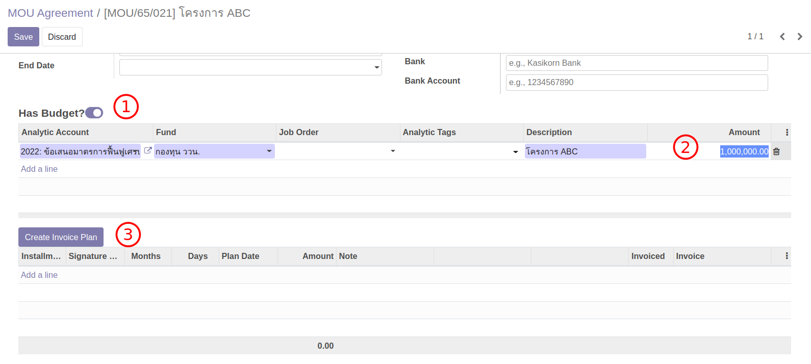
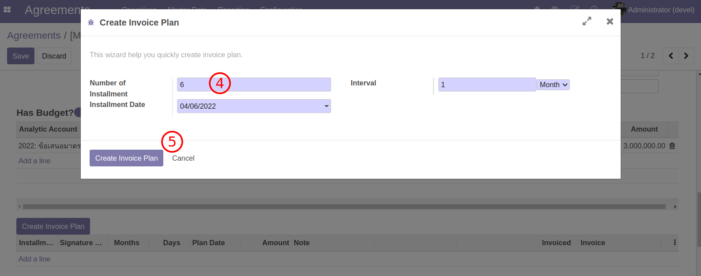
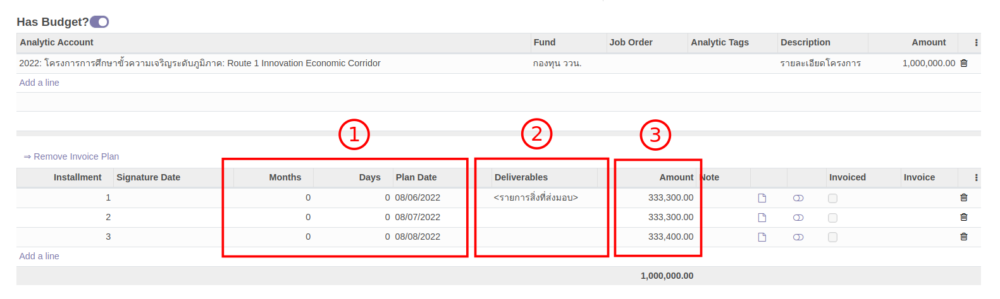
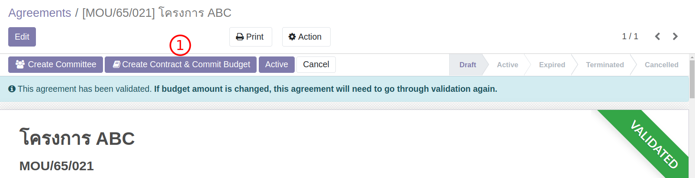
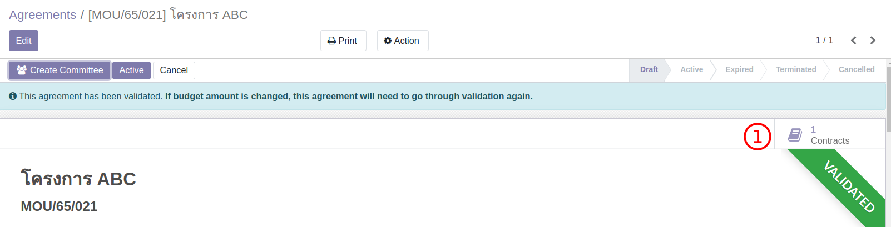
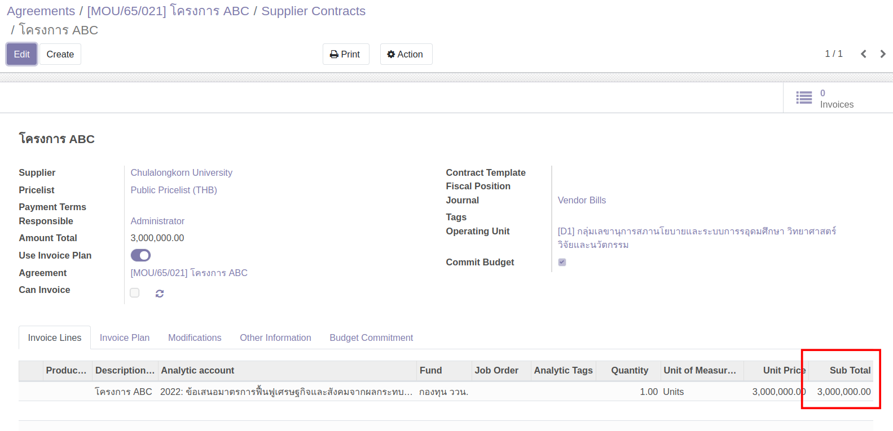

# สร้าง MOU แบบมีเงิน

**Menu:** Agreement > Operations > MOU Agreement

กรณีนี้จะเป็นการสร้าง MOU แบบมีเงิน (has budget) จาก Template MOU และส่งอนุมัติ

MOU แบบมีเงินแตกต่างกับ MOU แบบไม่มีเงินเฉพาะจุดที่เกี่ยวข้องกับการวางแผนการจ่ายเงินเท่านั้น
**และเนื่อหาในส่วนนี้จะเน้นเฉพาะส่วนที่แตกต่าง**

## สำหรับ ผู้ใช้งาน

### สร้าง MOU

1. สร้าง MOU ตามขั้นตอนปกติ (เหมือนกรณีไม่มีเงิน)
2. กรอกข้อมูลเพิ่มเติมในส่วนการเงิน

   

   1. เลือก Has Budget? ระบบจะเปิดส่วนการเงินขึ้มา
   2. กรอกยอดเงินรวมและเลือกโครงการและแหล่งทุน (Analytic Account, Fund)
   3. กดปุ่ม Create Invoice Plan ระบบจะเปิด Wizard ให้ใส่จำนวนงวด

   

   4. ใส่จำนวนงวดที่ต้องการ
   5. กดปุ่ม Create Invoice Plan ระบบจะสร้างตารางเงินงวด

3. ปรับข้อมูลบนตารางเงินงวด (ข้อมูลเหล่านนี้จะใช้ในการปรินท์เอกสาร MOU ด้วย)

   

   1. ใส่ระยะเวลากำหนดจ่ายเงินหลังจากวันเซ็นต์สัญญา
   2. สิ่งที่จะส่งมอบในงวดนั้นๆ (Deliverables)
   3. จำนวนเงินในแต่ละงวด

::: warning INFO
ตารางเงินงวดยังมีข้อมูลเกี่ยวกับการจ่ายเงินที่เรายังไม่ต้องสนใจในตอนนี้ โดยจะได้อธิบายเพิ่มเติมในขั้นตอนการจ่ายเงิน
:::

### ส่ง MOU เพื่อรับการอนุมัติ

1. ส่งอนุมัติเอกสาร สำหรับเอกสารที่พร้อมแล้ว (เหมือนกรณีไม่มีเงิน)

   

   1. กดปุ่ม Request Validation
   2. เอกสารจะมีแถบคาดสีเหลือเพื่อบอกว่าอยู่ระหว่างอนุมัติจะแก้ไขเนื่อหาไม่ได้
   3. ด้านล่างของเอกสารจะแสดงรายชื่อผู้ร่วมอนุมัติ (อาจมีหลายคน)

## สำหรับ ผู้อนุมัติ

### ทำการอนุมัติ MOU

1. ผู้อนุมัติ ทำการอนุมัติ/ไม่อนุมัติ เอกสาร MOU (เหมือนกรณีไม่มีเงิน)

   

   1. ผู้อนุมัติเมื่อล็อกอินเข้าระบบ จะเห็นรายการเอกสารที่ถูกส่งมาจากผู้ขอ
   2. เมื่อเปิดเอกสารจะเห็นปุ่ม เพื่ออนุมัติ หรือไม่อนุมัติ (Validate / Reject)
   3. เมื่อกดปุ่มระบบจะเปิด Wizard เพื่อให้ผู้อนุมติกรอกข้อความก่อนยืนยัน

2. เอกสารที่ได้รับการอนุมัติ สถานะเปลี่ยนเป็น Active

   

:::danger ข้อควรรู้
หลังจากที่เอกสารได้รับการอนุมัติแล้ว (มีแถบริบบิ้นเขียว VALIDATED) แต่หากมีการแก้ไขข้อมูลใดๆในส่วนการเงิน (จำนวนเงิน หรืองวดเงิน)
ระบบจะทำการปลดแถบ VALIDATED ทิ้งและเอกสารจะต้องผ่านการอนุมัติเห็นชอบใหม่
:::

## สำหรับ ผู้ใช้งาน

### สร้าง Contract เพื่อจองเงิน

สำหรับ MOU ทีมีเงิน หลังจากที่ได้รับการอนุมัติแล้ว ผู้ใช้งานสามารถสร้าง Contract เพื่อจองเงินงบประมาณได้ทันทีโดยที่ MOU อาจยังไม่ถึงเวลาเซ็นต์สัญา (Agreement ยังไม่ Active)

1. กดปุ่ม Crate Contract & Commit Budget เพื่อสร้างเอกสาร Contract เพื่อจองเงิน

   

2. เมื่อสร้าง Contract แล้วจะมีปุ่ม Contracts ผู้ใช้งานสามารถคลิกเปิดดูการจองเงินได้

   

3. ตอนนี้ Contract มีการจองเงินเท่ากับ MOU ที่ได้รับการอนุมัติ (และจะต้องเท่ากันเสมอ)

   

:::warning ข้อควรรู้
Contract ที่ถูกสร้างขึ้นฝ่ายการเงินจะยังไม่สามารถทำจ่ายได้ เนื่องจาก MOU ต้นทางยังไม่ได้รับการเซ็นต์สัญญา (Not Yet Active) ในภายหลังเมื่อ MOU ได้รับการ Active เมื่อนั้น Contract จะสามารถทำจ่ายได้ (Can Invoice = True)
:::

End.
