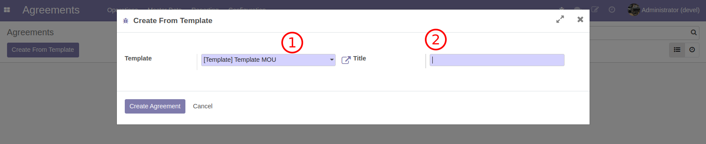
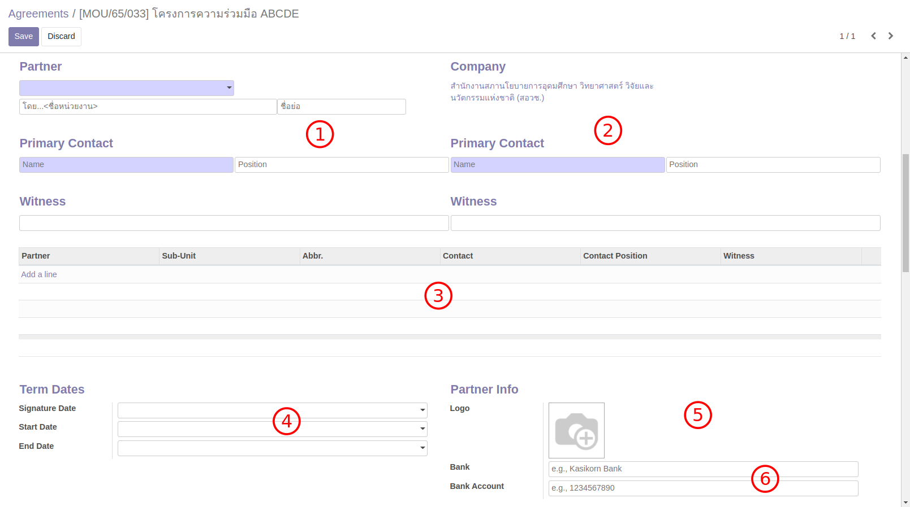
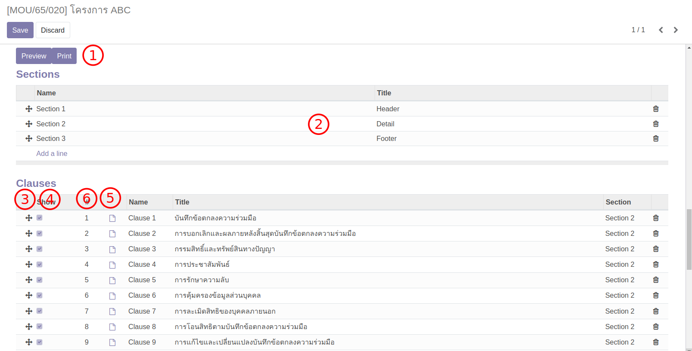
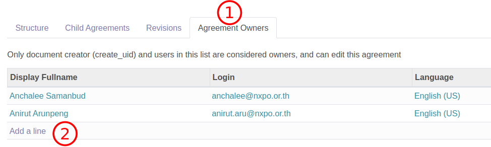
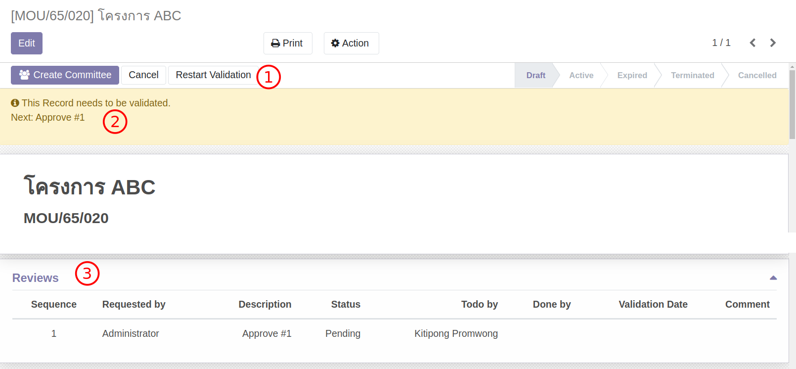
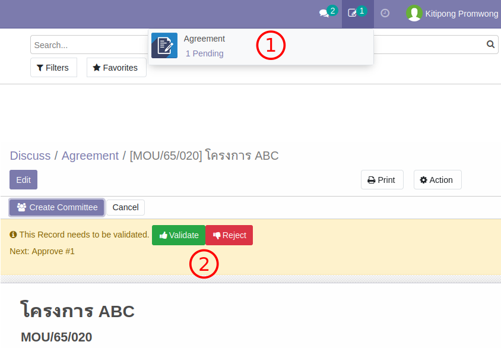
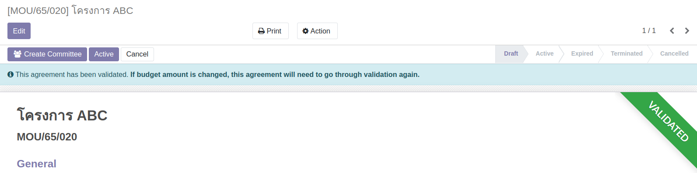
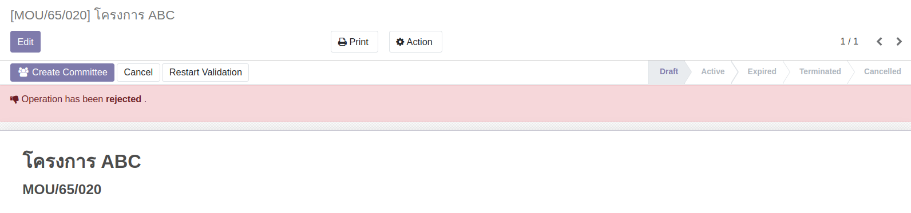
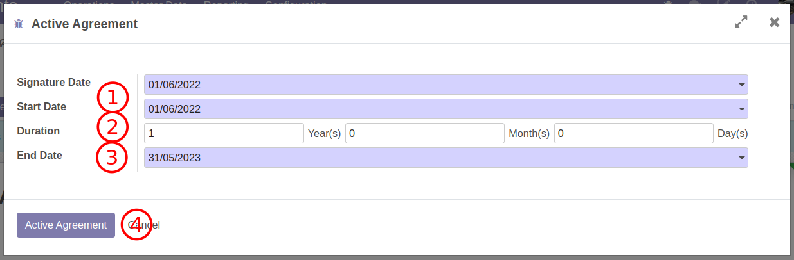
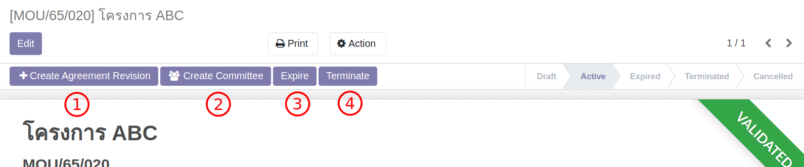

# สร้าง MOU แบบไม่มีเงิน

**Menu:** Agreement > Operations > MOU Agreement

กรณีนี้จะเป็นการสร้าง MOU แบบไม่มีเงินจาก Template MOU และส่งอนุมัติ
โดยปกติ MOU ประเภทนี้จะใช้เป็น MOU ใหญ่ (parent) สำหรับ MOU อื่นๆ (child) ที่จะเกิดขึ้นตามมาในอนาคต

เนื่องจากเป็น MOU ที่ไม่เกี่ยวข้องกับเงิน ขั้นตอนจะไม่ยาวมากและยังไม่มีการจองเงินด้วย Contract หรือการจ่ายเงินโดยฝ่ายบัญชีเข้ามาเกี่ยวข้องเหมือนกับ MOU แบบมีเงิน

## สำหรับ ผู้ใช้งาน

### สร้าง MOU

1. ไปที่เมนู MOU Agreement และกดปุ่ม Create From Template
2. กรอกข้อมูลเพื่อสร้าง MOU

   

   1. เลือก Template MOU เริ่มต้น
   2. ใส่ชื่อโครงการ

3. ระบบจะพาไปยัง MOU ที่ถูกสร้างขี้น ให้กดปุ่ม Edit เพื่อแก้ไขข้อมูลเพิ่มเติม
4. กรอกข้อมูลเพิ่มเติมสำหรับ MOU นี้

   :::warning
   ควรกรอกข้อมูลให้ครบทุกฟิลด์เพราะข้อมูลเหล่านี้ใช้ในการปรินท์ฟอร์ม
   :::

   

   1. หน่วยงานคู่สัญญาหลัก โดยหน่วยงานย่อย และตัวย่อ และชื่อผู้ติดต่อ ตำแหน่ง และพยาน
   2. ผู้ติดต่อ ตำแหน่ง และพยาน ของหน่วยงาน NxPO สำหรับ MOU นี้
   3. กรณีมีคู่สัญญามากกว่าหนึ่งหน่วยงาน ให้เพิ่มหน่วยงานอื่นๆ
   4. กรณีทราบวันเริ่มต้นและสิ้นสุดของ MOU (ใส่ภายหลังได้)
   5. ตามปกติระบบจะใช้รูปตราสัญลักษณ์ของหน่วยงานคู่สัญญาหลัก แต่สามารถใส่รูปอื่นแทนได้
   6. ใส่ข้อมูลธนาคารสำหรับการโอนเงิน เพื่อเป็นข้อมูลสำหรับฝ่ายการเงิน (ถ้ามี)

5. กรอกข้อมูลในส่วนเนื้อหาของ MOU (Section/Clauses/Appendix)

   

   1. Preview/Print เมื่อต้องการดูการปรินท์ฟอร์ม
   2. คลิกที่บรรทัด (ระหว่างการ Edit) เพื่อเปิดเนื้อหาขึ้นมาแก้ไข
   3. ลากสัญลักษณ์กากบาทขึ้นลงเพื่อเรียงลำดับใหม่
   4. ถ้าไม่ต้องการให้แสดงเนื้อหาส่วนใดให้เอาเครื่องหมายถูกที่ Show ออก
   5. ถ้ามีไฟล์แนบเพิ่มเติมให้คลิกที่ไอคอนและเข้าไปแนบไฟล์เพิ่มได้ที่ไอคอนรูปกระดาษ
   6. หลังกดปุ่ม Save เพื่อบันทึก MOU นี้ระบบจะเรียงหัวขัอการปรินท์ (1,2,3,...) ให้ใหม่

6. เพิ่มรายชื่อผู้ที่ต้องการให้แก้ไข MOU นี้ได้ที่ tab Agreement Owner

   

   1. คลิกที่ Agreement Owner
   2. เพิ่มรายชื่อที่ต้องการ

7. กดปุ่ม Save ด้านซ้ายบนของเอกสารเพื่อบันทึก

::: warning
เฉพาะผู้สร้าง MOU หัวหน้าโครงการ (Project Lead) และผู้มีรายชื่อใน Agreement Owners เท่านั้นที่สามารถแก้ไขเอกสารได้
:::

### ส่ง MOU เพื่อรับการอนุมัติ

1. ส่งอนุมัติเอกสาร (เมื่อพร้อม)

   

   1. กดปุ่ม Request Validation
   2. เอกสารจะมีแถบคาดสีเหลือเพื่อบอกว่าอยู่ระหว่างอนุมัติจะแก้ไขเนื่อหาไม่ได้
   3. ด้านล่างของเอกสารจะแสดงรายชื่อผู้ร่วมอนุมัติ (อาจมีหลายคน)

## สำหรับ ผู้อนุมัติ

### อนุมัติ MOU

1. ผู้อนุมัติ ทำการอนุมัติ/ไม่อนุมัติ เอกสาร MOU

   

   1. ผู้อนุมัติจะเห็นรายการเอกสารที่ถูกขอ
   2. เมื่อเปิดเอกสารจะเห็นปุ่ม อนุมัติและไม่อนุมัติ (Validate / Reject)
   3. เมื่อกดปุ่มระบบจะเปิด Wizard เพื่อให้ผู้อนุมติกรอกข้อความก่อนยืนยัน

2. เอกสารที่ได้รับการอนุมัติ สถานะเปลี่ยนเป็น Active

   

3. เอกสารที่ไม่ได้รับการอนุมัติ สถานะเปลี่ยนเป้น Rejected

   

## สำหรับ ผู้ใช้งาน

### เซ็นต์สัญญา MOU (Activate)

เมื่อเอกสารได้รับการเซ็นต์สัญญาเพื่อเริ่มการทำงานแล้ว (ตกลงกันนอกระบบ) จะต้องกลับมาที่ระบบเพื่อทำการ Activate MOU นี้ด้วย

1. ไปที่เมนู MOU Agreement เพื่อเรียกดู MOU ที่ต้องการ Activate
2. กดปุ่ม Active ระบบจะเปิด Wizard ให้กรอกข้อมูล

   

   1. กรอกวันที่ Signature Date และ Start Date
   2. ใส่ระยะเวลาของสัญญา (ถ้าต้องการให้ระบบช่วยคำนวนวัน End Date)
   3. กรอกวันที่ End Date
   4. กดปุ่ม Active Agreement

3. เอกสารจะเปลี่ยนสถานเป็น Active และไม่สามารถแก้ไขได้

เมื่อ MOU เปลี่ยนสถานะเป็น Active แล้ว ที่ Contract จะปลดล็อกและสามารถทำจ่ายได้

:::info เมื่อเอกสารมีสถานะเป็น Active

1. แก้ไข MOU เพิ่มเติมโดยการสร้าง revision ใหม่ด้วย Template MOU (แก้ไขเพิ่มเติม)
2. สร้างชุดคณะกรรมการ (กรณียังไม่ได้เคยมีคณะกรรมการมาก่อน)
3. เปลี่ยน MOU เป็น Expired (ระบบจะมีการเตือนล่วงหน้าก่อนหมดอายุแต่เป็นหน้าที่ของผู้สร้างเอกสาร ในการเปลี่ยนสถานะ)
4. เปลี่ยน MOU เป็น Terminate กรณีต้องการสิ้นสุด MOU ด้วยเหตุผลใดก็ตาม

:::

End.
