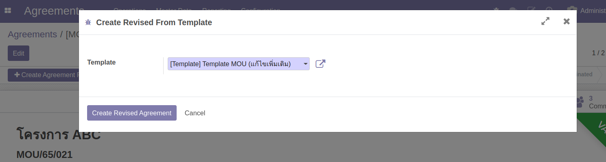
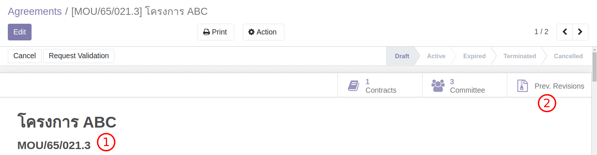

# แก้ไขเพิ่มเติม MOU

**Menu:** Agreement > Operations > MOU Agreement

สำหรับกรณีที่มีการเปลี่ยนแปลง MOU เช่น เพิ่มงาน เพิ่มเงิน ปรับงวด และอื่นๆ การเปลี่ยนแปลง (Create Agreement Revision) จะใช้ Template MOU (แก้ไขเพิ่มแติม) ในทางระบบจะเป็นการทำสำเนา MOU
เดิมแต่ต่างก็ในส่วนของเนื้อหา (Section/Clause/Appendix)

หลังจากปรับแก้เนื้อหาและงวดเงินเรียบร้อยจะต้องถูกส่งอนุมัติใหม่ก่อน Active เพื่อใช้งานอีกรอบ

## สำหรับ ผู้ใช้งาน

### สร้าง Revision ใหม่

1. ไปที่เมนู MOU Agreement และค้นหา MOU ที่ต้องการเปลี่ยนแปลง
2. กดปุ่ม Create Agreement Revision ระบบจะสร้าง MOU ใหม่ด้วย Template MOU (แก้ไขเพิ่มเติม)

   

3. กดปุ่ม Create Revised Agreement ระบบจะสร้าง Version ใหม่ (และซ่อน version เดิม)

   

   1. สังเกตุเลขต่อท้ายแสดงครั้งที่แก้ไข
   2. กดปุ่ม Prev. Revision เพื่อดูเอกสาร Version ย้อนหลัง

4. ที่ MOU ใหม่ ทำการเปลี่ยนแปลงข้อมูลตามต้องการ เช่น เปลี่ยนงวดเงิน หรือเปลี่ยนเนื้อหา (Section/Clauses)
5. กดปุ่ม Request Validation เพื่อส่งอนุมัติใหม่

:::warning ข้อควรรู้

การเปลี่ยนงวดเงินจะสามารถทำได้กับงวดที่ยังไม่ผ่านการสร้าง Vendor Bill เท่านั้น สำหรับงวดที่ผ่านการ Bill ไปแล้วจะเป้น Readonly

:::

End.
