# การค้นหา MOU

**Menu:** Agreement > Operations > MOU Agreement

แนะนำวิธีการใช้งาน Advance Search เพื่อค้นหา MOU ที่ต้องการ

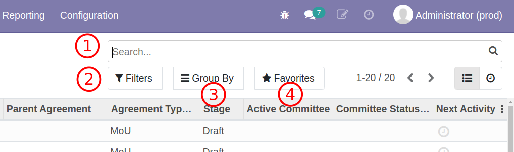

1. ค้นหาด้วยการพิมพ์ (Search Bar)
2. ตัวกรอง (Filter)
3. การจัดกลุ่ม (Group By)
4. จัดเก็บการค้นหาที่ใช้บ่อย (Favorite)

## Search Bar

เป็นการค้นหาทั่วไปอย่างง่ายโดยการพิมพ์ข้อความ

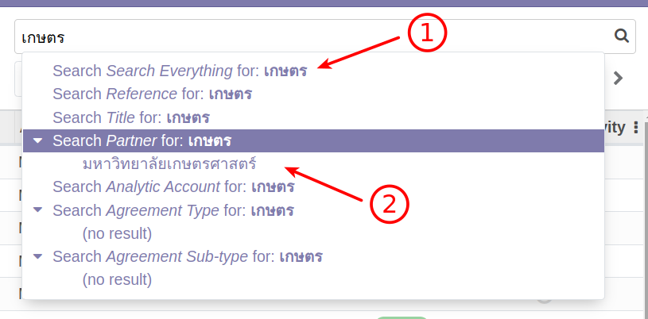

1. ค้นหาหลายๆฟิลด์พร้อมๆกัน (Search Everything) ฟิลด์นี้ค่อนข้างพิเศษเพราะการพิมพ์ครั้งเดียวจะใช้ค้นหาข้อมูลต่อไปนี้พร้อมๆกันเช่น

   - หมายเลขของ MOU (Code)
   - ชื่อของ MOU นี้ (Name)
   - หัวหน้าโครงการ (Project Lead)
   - ผู้ติดต่อ (Contact)
   - ฝ่าย (Operating Unit)
   - โครงการ (Analytic Account)
   - ชื่อหน่วยงานที่เกี่ยวข้อง (Partners)

2. ค้นหาเฉพาะฟิลด์ เป็นการเลือกว่าสิ่งที่พิมพ์จะให้ค้นฟิลด์อะไร เช่นกรณีนี้ค้นหาหน่วยงานเท่านั้น โดยระบบจะเผยหน่วยงานที่ค้นเจอด้วย (เช่นมหาวิทยาลัยเกษตรศาสตร์)

## Filter

ระบบได้จัดเตรียมตัวกรองไว้ให้ระดับหนึ่ง และยังสามารถเพิ่มตัวกรองได้เองด้วย

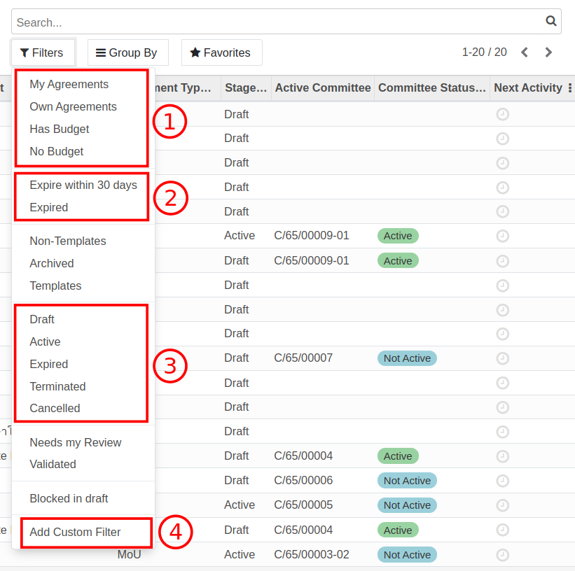

ตัวกรองที่น่าสนใจมีดังนี้

1. เกี่ยวกับตัว MOU

   - My Agreements: MOU ที่เราเป็นผู้สร้าง
   - Own Agreements: MOU ที่เราเป็นผู้สร้าง เป็นหัวหน้าโครงการ หรือเรามีส่วนร่วม
   - Has Budget: มีเงิน
   - No Budget: ไม่มีเงิน

2. เกี่ยวกับวันหมดอายุของ MOU (เทียบกับ End Date)

   - Expire in 30 days: หา MOU เฉพาะที่ใกล้หมดอายุ
   - Expired: หา MOU เฉพาะที่หมดอายุแล้ว

3. เกี่ยวกับสถานะของเอกสาร

   - Draft: อยู่ระหว่างจัดทำหรือยังไม่ได้รับการอนุมัติ
   - Active: ได้รับการอนุมัติแล้วและเซ็ตน์สัญญาเริ่มงานแล้ว
   - Terminated: ยุติโครงการแล้ว
   - Expired: หมดอายุแล้ว
   - Cancelled: ยกเลิก

4. ตัวกรองเพิ่มเติม (Add Custom Filter)

   หากตัวกรองที่มีไม่ตอบการค้นหา สามารถใช้ตัวกรองเพิ่มเติมหาได้ทุกฟิลด์ของ MOU

   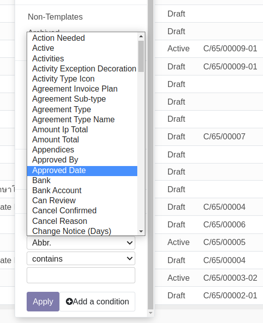

## Group By

หลังจากได้ค้นหาข้อมูลได้ผลลัพธ์ที่ต้องการ ผู้ใช้งานสามารถใช้การจัดกลุ่มเพื่อดูข้อมูลได้ง่ายขึน

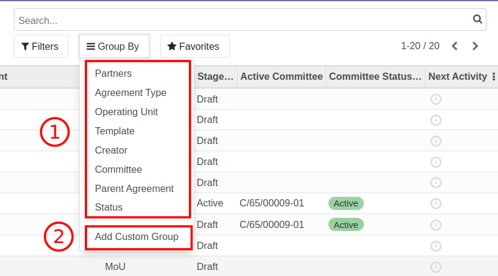

1. การจัดกลุ่มที่ระบบจัดเตรียมไว้ให้ เช่นตามหน่วยงาน

   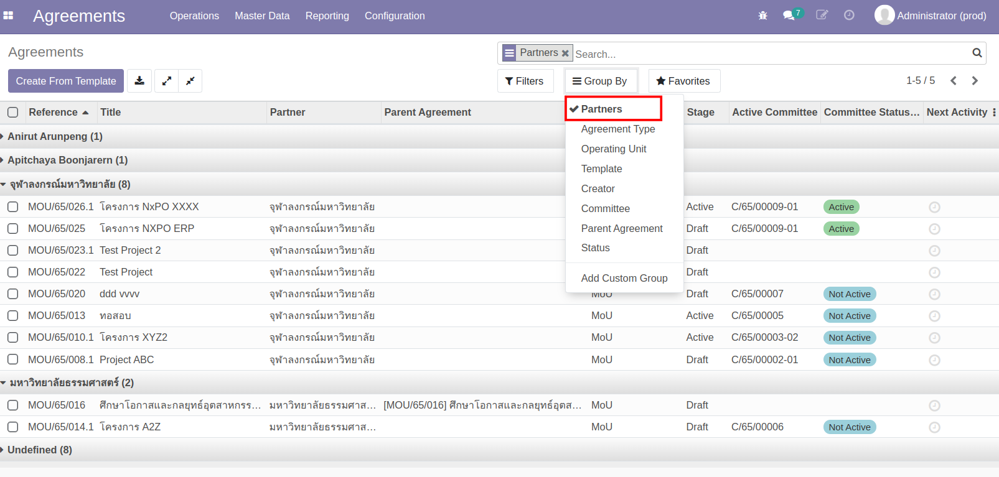

2. การจัดกลุ่มเพิ่มเติม (Add Customer Group) สำหรับกรณีนอกเหนือจากที่ระบบจัดไว้ (ค้นได้ทุกฟิลด์ของ Agreement)

   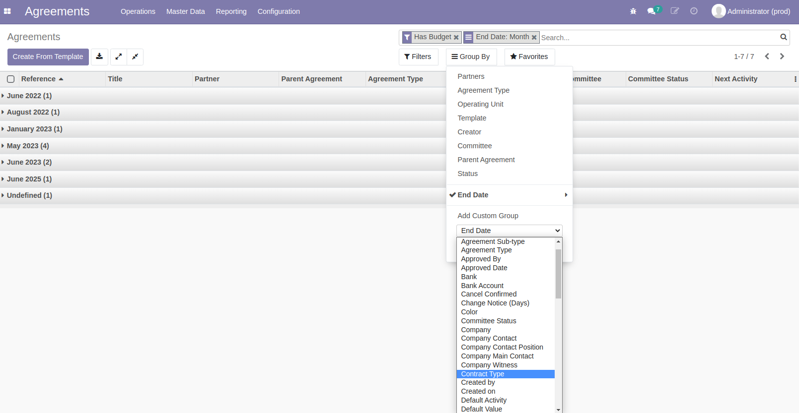

## Favorite

และหลังจากที่ได้ใช้ Search, Filter, Group By จนได้ผลที่ต้องการแล้ว ผู้ใช้งานยังสามารถจัดเก็บกาค้นหาที่ใช้บ่อยได้ผ่าน Favoite

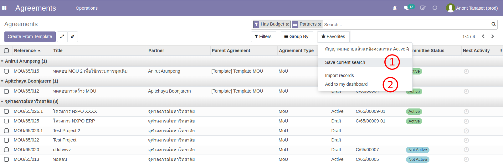

1. เก็บการค้นหาเป็น Favorite (Save Current Search)

   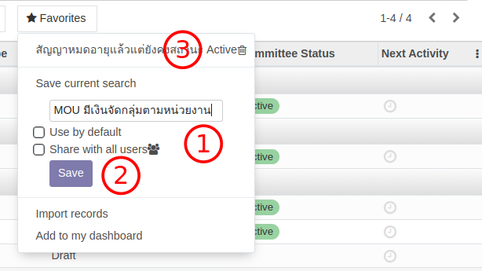

   1. ตั้งชื่อการค้นหา และเลือกว่าจะใช้เป็นการค้นหาเริ่มต้นของการเข้ามาที่หน้าต่างนี้หรือไม่
   2. กดปุ่ม Save เพื่อจัดเก็บ
   3. ระบบจะเก็บการค้นหาไว้สำหรับใช้ต่อไป

2. หรือจัดเก็บเป็นรายงานส่วนตัว (Add to my dashboard)

   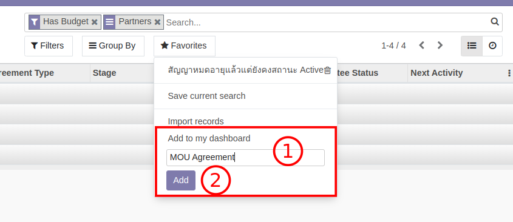

   1. ตั้งชื่อรายงาน
   2. กดปุ่ม Add เพื่อสร้างรายงานไว้ที่ My Dashboard
   3. เข้าไปยังรายงาน My Dashboard

   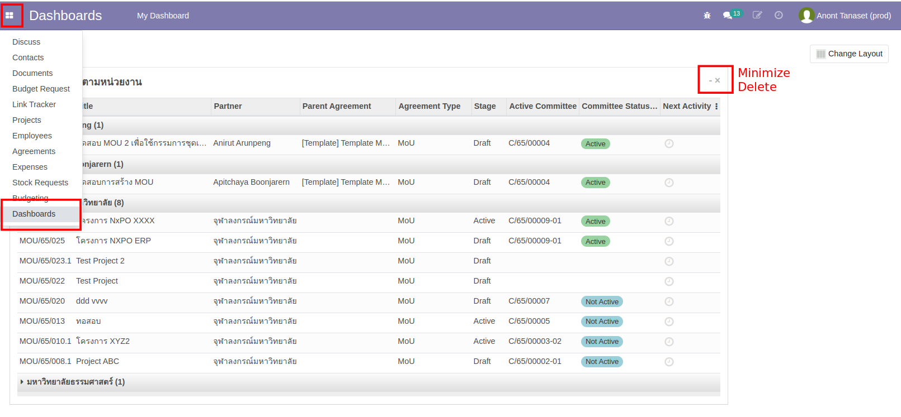

End.
