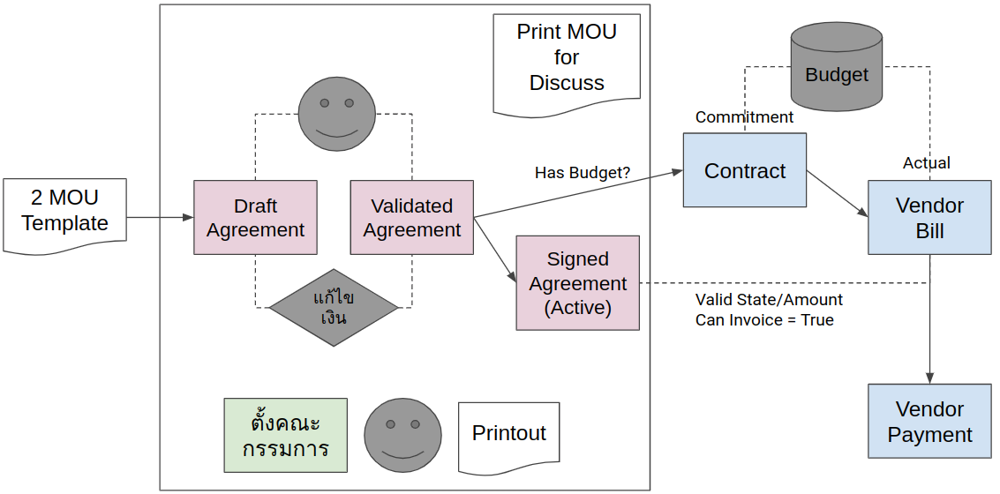
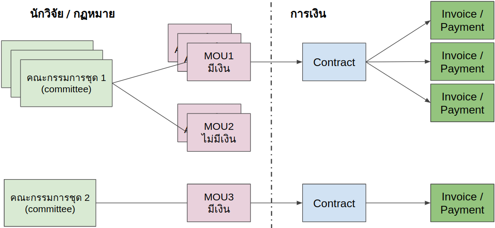
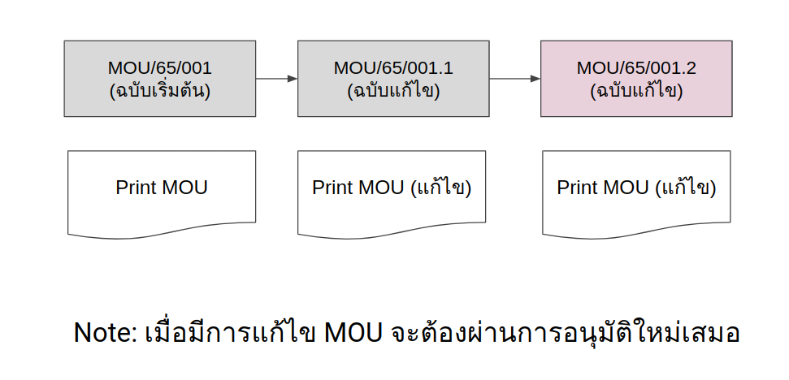
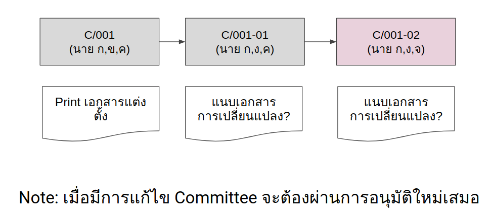

# MOU Overview

ระบบ Odoo จะเข้ามาช่วยจัดระเบียบในกระบวนการสร้าง MOU ด้วย template, การอนุมัติ MOU โดยผู้บริหาร, การจองงบประมาณด้วย Contract, การแต่งตั้งคณะกรรมการสำหรับดูแล MOU นั้นๆ และสุดท้ายไปจนถึงการจ่ายเงินสำหรับงวดงานที่เกิดขึ้นและผ่านการเห็นชอบโดยคณะกรรมการ

## ขั้นตอนการทำงานทั่วไป

1. ผู้ใช้งานสร้าง MOU จาก Template MOU
2. ใส่ข้อมูลที่ MOU ต้องการเช่น องค์กรความร่วมมือ บุคคลที่เกี่ยวข้อง และอื่นๆ
3. ใส่ข้อมูลด้านการเงิน (ถ้ามี) ที่ตารางเงินงวด
4. ตรวจสอบเนื้อหาในส่วน Section / Clause / Appendix ลอง Preview ดู
5. ผู้ใช้งานสามารถข้ามเนื้อหาบางส่วนที่ไม่ต้องการ และไฟล์เอกสารจากภายนอกได้
6. เมื่อ MOU พร้อม ส่งเอกสารให้ผู้บริหารอนุมัติ
7. เมื่อ MOU ได้รับการอนุมัติแล้วผู้ใช้งานสามารถสร้าง Contract เพื่อจองเงินงบประมาณไว้ก่อนแม้ว่า MOU จะยังไม่เซ็นต์สัญญา (not active)
8. แต่งตั้งคณะกรรมการเพื่อดูแล MOU (แต่งตั้งชุดใหม่ หรือเลือกจากชุดคณะกรรมการที่มีอยู่แล้ว)
9. เมื่อเซ็นต์สัญญา ผู้ใช้งานทำการ active MOU และกำหนดวันที่ที่เกี่ยวข้อง เช่น Signature Date, Start/End Date
10. เมื่อเวลาผ่านไป และเสร็จงานในแต่ละงวด ผู้ใช้งานเข้ามาที่ MOU นี้และแจ้งให้ฝ่ายการเงินทำการจ่ายเงินงวดที่ต้องการได้

## ความสัมพันธ์ของเอกสาร (MOU/Committee/Contract)

- แต่ละ MOU สามารถแก้ไขได้ (หลายเวอร์ชั่น) แต่จะมี 1 MOU ที่ Active
- แต่ละชุดคณะกรรมการ (Committee) สามารถแก้ไขได้ (หลายเวอร์ชั่น) แต่จะมี 1 Committee ที่ Active
- 1 Committee อาจทำงานให้กับหลายๆ MOU ได้ (ส่วนใหญ่จะเป็น MOU ที่มีความเกี่ยวข้องกัน)
- Contract ถูกสร้างขึ้นได้จาก MOU ที่มีเงินเท่านั้น และมีความสัมพันธ์กันโดยตรง (1:1)
- 1 Contract อาจมีการจ่ายเงินหลายงวด (Invoices/Payments)

