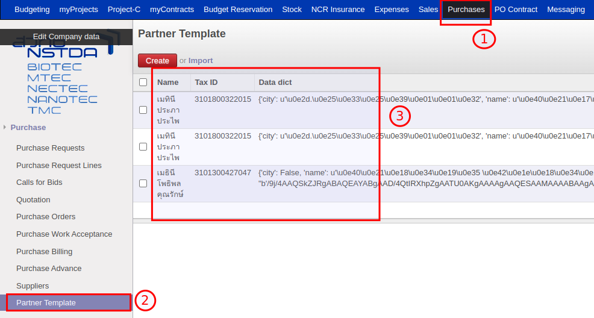
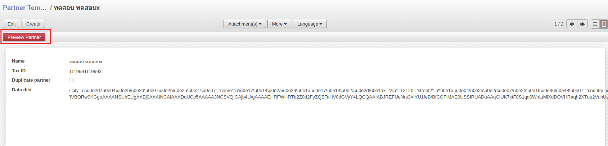
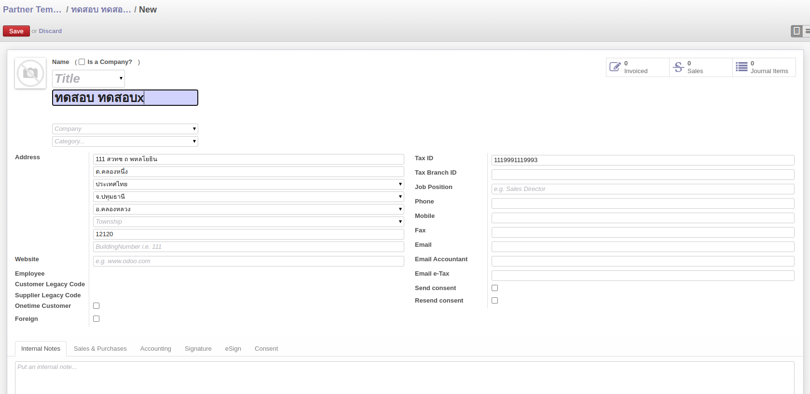
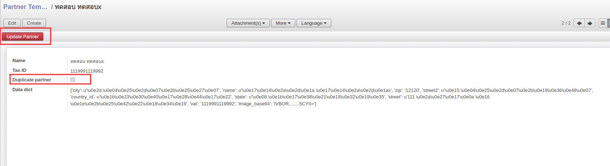

## การสร้างคู่ค้าจากระบบลงทะเบียน

เมื่อทางคู่ค้าใหม่ลงทะเบียนกับทาง สวทช. ระบบลงทะเบียนจะส่งข้อมูลที่คู่ค้ากรอกมาใส่ให้ในระบบ PABI2 เพื่อสร้างข้อมูลรอเจ้าหน้าที่พัสดุพิจารณาต่อไป และเมื่อสร้างหรือแก้ไขเสร็จสิ้นแล้วระบบจะลบข้อมูลที่ระบบลงทะเบียนส่งมา

### การส่งข้อมูลเข้าระบบ PABI2

- HTTP Route จะต้องเรียก Function **/create_partner_temp**
- Header การส่งค่าผ่าน API จะต้องมี
    - db
    - login
    - password
    
            header = {
                "db": "<ชื่อ database>",
                "login": "<username pabi2>",
                "password": "<password pabi2>"
            }

- Body การส่งค่าผ่าน API จะต้องเป็น
    - {"params": {"data": {<ข้อมูลที่ต้องการส่ง>}}}

            body = {
                "params": {
                    "data": {
                        "name": "ทดสอบ ทดสอบx",
                        "street": "111 สวทช ถ พหลโยธิน",
                        "street2": "ต.คลองหนึ่ง",
                        "city": "อ.คลองหลวง",
                        "state": "จ.ปทุมธานี",
                        "zip": "12120",
                        "country_id": "ประเทศไทย",
                        "vat": "1119991119993",
                        "image_base64": "iVBOR........5CYII="  # แนบ attachment รูปบัตรประชาชน
                        .
                        .
                        .
                        <สามารถส่งค่าอื่นมาได้ตามชื่อ field ในระบบ PABI2>
                    }
                }
            }

หลังจากส่งเข้าระบบ PABI2 แล้วข้อมูลในส่วนนี้จะไปอยู่ที่เมนู Purchase > Partner Template
ซึ่งระบบจะตรวจสอบว่าเป็นคู่ค้ารายเดิม หรือคู่ค้ารายใหม่ และจะมีขั้นตอนการทำงานต่างกันเล็กน้อย

### การลงทะเบียนคู่ค้ารายใหม่ในระบบ PABI2

1. ไปที่เมนู Purchase > Purchase > Partner Template
2. หากมีเอกสารในระบบ หมายถึง มีการลงทะเบียนมาเพิ่ม แต่ทางเจ้าหน้าที่พัสดุยังไม่ได้ดำเนินการ

3. กรณีที่เป็นคู่ค้ารายใหม่ ระบบจะแสดงปุ่ม Preview Partner
4. คลิก Preview Partner เพื่อให้ระบบสร้างคู่ค้าในระบบ

5. ระบบจะสร้างคู่ค้าใหม่ให้ในระบบ โดยมีค่าเริ่มต้นตามที่ระบบลงทะเบียนส่งข้อมูลมา

6. เจ้าหน้าที่พัสดุตรวจสอบ แก้ไขข้อมูลให้ถูกต้อง > Save
7. เมื่อกด Save ระบบจะลบข้อมูลที่หน้า Partner Template และสร้างคู่ค้าให้

### การลงทะเบียนคู่ค้ารายเดิมในระบบ PABI2

กรณีนี้อาจเกิดจากคู่ค้าต้องการ Update ข้อมูลในระบบ จึงทำการลงทะเบียนมาอีกครั้งหนึ่ง ซึ่งหลักการทำงานจะคล้ายกับการสร้างใหม่ โดยมีขั้นตอนดังนี้

1. ไปที่เมนู Purchase > Purchase > Partner Template
2. กรณีที่เป็นคู่ค้ารายเดิมลงทะเบียนใหม่ ระบบจะแสดงปุ่ม Update Partner และ Duplicate partner

3. เมื่อกดปุ่ม Update Partner ระบบจะขึ้นข้อความเตือนอีกครั้งหนึ่ง เพราะการ Update ข้อมูลจะเป็นการ**บันทึกทับข้อมูลเดิม**
4. เมื่อยืนยัน ระบบจะบันทึกข้อมูลใหม่ทับข้อมูลเดิม, แสดงหน้าคู่ค้ารายนั้น และลบข้อมูลที่หน้า Partner Template
5. หากข้อมูลยังไม่ถูกต้อง เจ้าหน้าที่พัสดุสามารถกด Edit เพื่อแก้ไขข้อมูลให้ถูกต้องได้
