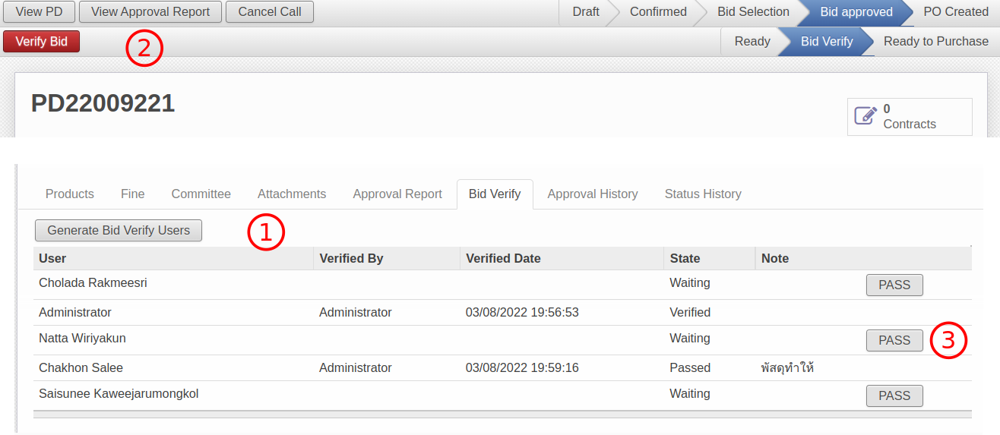
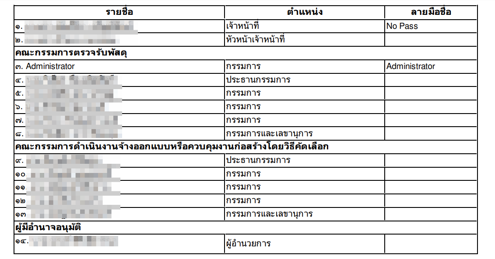

## As-Is

เมื่อสถานะของเอกสาร Call for Bid เปลี่ยนจาก Bid Selection เป็น **Bid Approved** (โดย AF)
เจ้าหน้าที่พัสดุจะทำหน้าที่สร้าง RFQ และสถานะจะเปลี่ยนเป็น **PO Created** ได้เลยโดยไม่ต้องมีการอนุมัติใด ๆ เพิ่มเติมจากผู้มีส่วนได้เสียในการจัดซื้อ

## To-Be

เมื่อสถานะของเอกสารเปลี่ยนเป็น **Bid Approved** เพิ่มกระบวนการ Verify อีกครั้งหนึ่งจากผู้มีส่วนได้เสียทุกคนก่อนที่เจ้าหน้าที่พัสดุจะสามารถสร้าง RFQ ได้

โดยระบบจะเพิ่มให้มี **Sub States** ระหว่างสถานะ **Bid Approved** ดังรูป เพื่อติดตามสถานะของการอนุมัติจากผู้มีส่วนได้เสีย

1. Ready: สถานะเริ่มต้นเมื่อ State = Bid Approved
2. Bid Verify: เมื่ออยู่ระหว่างการอนุมัติของผู้มีส่วนได้เสีย (ในตาราง tab Bid Verify)
3. Ready to Purchase: เมื่อผู้มีส่วนได้เสียทุกคนได้ทำการ Verify

!!! info

    หากไม่ต้องการขั้นตอน Bid Verify เจ้าหน้าที่พัสดุสามารถเลี่ยงได้โดยกดปุ่ม Ready to Purchase
    โดยระบบจะ bypass Bid Verify ไปเลย และสามารถสร้าง RFQ ต่อได้ทันทีเหมือนการทำงานเดิม

---

### Substate: Ready

เมื่อ State = Bid Approved, Substate จะเปลี่ยนเป็น Ready โดยอัตโนมัติ

โดยจะมี 2 ทางเลือกสำหรับเจ้าหน้าที่พัสดุ

1. Bid Verify เพื่อเข้ากระนวนการ verify โดยผู้มีส่วนได้เสีย
2. Ready to Purchase เพื่อข้ามขั้นตอนนี้ และทำงานตามปกติ

---

### Substate: Bid Verify

เมื่อสถานะเปลี่ยนเป็น Bid Verify สิง่ที่ระบบจะดำเนินการคือ

1. สร้างตารางผู้มีส่วนได้เสีย (Bid Verify Users)
2. ส่ง Intray Message เพื่อแจ้งเตือนผู้มีส่วนได้เสีย
3. แบบฟอร์ม ผู้มีส่วนได้เสีย

#### สร้างตารางผู้มีส่วนได้เสีย

ผู้มีส่วนได้เสียจะนำมาจาก Responsible, Verified By, Approver และ
Users จาก Committee tab

1. Bid Verify tab นี้จะแสดงเฉพาะกรณีที่มีตารางผู้มีส่วนได้เสียเท่านั้น
    * กรณีข้ามขั้นตอน จะไม่มีการสร้างตารางนี้ และไม่ต้องแสดง
    * เจ้าหน้าที่พัสดุสามารถกดปุ่ม Generate Bid Verify Users ได้กรณีต้องการลบสร้างใหม่
2. เมื่อผู้มีส่วนได้เสีย Login เข้ามาในระบบ จะกดปุ่ม Verify เพื่อยืนยัน (สถานะ verified)
3. กรณีที่ไม่มายืนยัน เจ้าหน้าที่พัสดุสามารถทำแทนได้โดยกดปุ่ม PASS พร้อมเหตุผล (สถานะ Passed)

#### ส่ง Intray Message เพื่อแจ้งเตือนผู้มีส่วนได้เสีย

ข้อความแจ้งเตือนจะส่งให้ 4 กลุ่ม

1. เจ้าหน้าที่พัสดุ (Responsible)
2. หัวหน้าเจ้าหน้าที่พัสดุ (Verified by)
3. คณะกรรมการ (Committee)
4. ผู้มีอำนาจอนุมัติ (PR. Approver)

โดยรูปแบบข้อความจะเป็น

    <เลขที่เอกสาร Call for Bid> ขอยืนยันแบบตรวจสอบการมีส่วนได้เสียในการจัดซื้อจัดจ้าง <วัตถุประสงค์> ของ <ชื่อผู้มีส่วนได้เสียของแต่ละคน>

ตัวอย่าง

#### แบบฟอร์ม ผู้มีส่วนได้เสีย (Conflict of interest Report)

ฟอร์มผู้มีส่วนได้เสีย: Print > Conflict of interest Report

รูปแบบฟอร์มผู้มีส่วนได้เสียอยู่ที่แบ่งเป็น 3 ส่วน

1. ข้อความหลัก
    
    - (1) วันที่ (COI Date)

        - เลือกวันที่เองได้ที่ Approval Report Tab
        - สามารถเปลี่ยนวันที่ได้ทุกสถานะ แต่จะมีการเก็บ Log ไว้ด้านล่าง
        

    - (2) ฝ่าย (Division) ที่เกี่ยวข้องกับเอกสาร PR ของ Budget นั้นๆ กรณีที่มีมากกว่า 1 ฝ่าย จะแสดงทุกฝ่ายโดยเชื่อมด้วยคำว่า "และ"
    - (3) เลขที่เอกสาร PR ของ Call for Bid นั้นๆ กรณีที่มีมากกว่า 1 PR ให้แสดงทุกเลขที่เอกสาร โดยเชื่อมด้วย "," (comma)

2. ตารางผู้มีส่วนได้เสีย
    
    - รายชื่อผู้มีส่วนได้เสีย จะแบ่งเป็น 4 กลุ่ม
        1. **เจ้าหน้าที่พัสดุ**: Responsible
        2. **หัวหน้าเจ้าหน้าที่พัสดุ**: Verified by ใน "Approval Report" Tab
        3. **คณะกรรมการ**: "Committee" Tab โดยแยกตามประเภทคณะกรรมการ
        4. **ผู้มีอำนาจอนุมัติ**: PR. Approver
    - ตำแหน่ง
        1. **คณะกรรมการ**: ดึงข้อมูลจาก Position ในตาราง Committee
        2. **ผู้มีอำนาจอนุมัติ**: ดึงข้อมูลจาก Management Position ในข้อมูล Employee ของคนนั้นๆ ถ้าไม่มีจะดึงข้อมูลจาก Position แทน
    - ลายมือชื่อ
        1. กรณีที่ผู้ที่มีรายชื่อกด Verify - แสดงรายชื่อ
        2. กรณีที่พัสดุกด PASS - แสดงเหตุผล
        3. กรณีที่ยังไม่มีการอนุมัติ - แสดงค่าว่าง

3. หมายเหตุประกอบ
    

---

### หมายเหตุเพิ่มเติม

!!! note

    * ปกติผู้มีส่วนได้เสียไม่มีสิทธิ์เห็น Call for Bid แต่กรณนี้เมื่อได้รับ Intray Message จะคลิก link เพื่อเข้ามาเปิดเอกสาร ดังนั้นระบบต้องเพิ่ม security rule ให้ด้วย
    * หาก substate != Ready to Purchase และไม่ใช่กรณี bypass ระบบต้องไม่ยอมให้มีการเปลี่ยน state เป็น PO Created (โดยการสร้าง RFQ)
