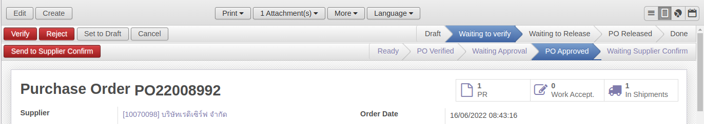

## As-Is

เมื่อสถานะของเอกสาร Purchase Order เปลี่ยนจาก Bid Selection เป็น **Waiting to Verify**
หัวหน้าพัสดุจะเป็นคนกดปุ่ม "Verify" เพื่อเปลี่ยนสถานะเป้น **Waiting to Release** โดยไม่ต้องมีการอนุมัติใดๆเพิ่มเติม

และกดปุ่ม "Release" เพื่อเปลี่ยนสถานะเป็น **PO Released**

## To-Be

เมื่อสถานะของเอกสารเปลี่ยนเป้น **Waiting to Verify** เราต้องการให้มีการลงนาม
จาก 1) บุคคลภายในผ่าน Camunda Workflow และตามด้วย 2) บุคคลภายนอกผ่านระบบ eSign (Supplier's Contacts)

โดยระบบจะเพิ่มให้มี **Sub States** ระหว่างสถานะ **Waiting to Verify** ดังรูป เพื่อติดตามสถานะของการลงนามก่อนที่จะเปลี่ยนสถานะเป็น **Waiting to Release** เพื่อกลับเข้า Flow ปกติ

1. Ready: สถานะเริ่มต้นเมื่อ State = Waiting to Verify
2. PO Verified: หลังจากหัวหน้าเจ้าหน้าที่พัสดุ Verify with eSign Process
3. Waiting Approval: หลังจากเจ้าหน้าที่พัสดุ Send to Approval เพื่อลงนามโดยบุคคลภายในผ่าน **Camunda Workflow**
4. PO Approved: เมื่อจบ Camunda Workflow
5. Waiting Supplier Confirm: เมื่อพนักงานพัสดุ Send to Supplier Confirm เพื่อการลงนามโดยบุคคลภายนอกโดยระบบ **eSign**

!!! info

    หากไม่ต้องการขั้นตอนการลงนาม หัวหน้าพัสดุสามารถเลี่ยงได้โดยกดปุ่ม Verify แบบปกติ

---

### Substate: Ready

เมื่อ State = Bid Approved, Substate จะเปลี่ยนเป็น Ready โดยอัตโนมัติ

โดยจะมี 2 ทางเลือกสำหรับหัวหน้าพัสดุ

1. Verify with eSign Process เพื่อเข้ากระบวนการลงนาม
2. Verify เพื่อข้ามขั้นตอนนี้ และเปลี่ยนสถานะเป็น Waiting to Release ทันที

---

### Substate: PO Verified

เจ้าหน้าที่พัสดุจะเข้ามาทำงานต่อ

1. เลือก Approve PO Form เพื่อเตรียมแนบเป็น attachment
2. กดปุ่ม Send to Approval

---

### Substate: Waiting Approval

สถานะนี้เป็นการส่งต่อไปที่ Camunda Workflow โดยระบบจะดำเนินการดังต่อไปนี้

1. พิมพ์ฟอร์ม Approve PO Form เป็น attachment แนบไว้กับเอกสาร (on background)
2. ส่ง Intray Message เพื่อแจ้งเตือนผู้มีส่วนได้เสียให้เข้าไปอนุมัติต่อที่ Camunda
3. ยิง API (data + attachment links) เพื่อ start Camunda Workflow
4. ดึงข้อมูล Workflow จาก Camunda มาไว้ที่ Approval History

#### พิมพ์ฟอร์ม Approve PO Form

ระบบ print เอกสารจาก Approve PO Form แล้วแนบไฟล์เข้าไปที่เอกสารนั้นให้อัตโนมัติ โดยที่ชื่อไฟล์แนบจะเป็นเลขที่เอกสาร

#### ส่ง Intray Message

ข้อความแจ้งเตือนจะส่งให้ 4 กลุ่ม โดยดูจากเอกสาร PD

1. เจ้าหน้าที่พัสดุ (Responsible)
2. หัวหน้าเจ้าหน้าที่พัสดุ (Verified by)
3. ผู้มีส่วนได้เสีย (Bid Verify)
4. ผู้มีอำนาจอนุมัติ (PR. Approver)

โดยรูปแบบข้อความจะเป็น

    <เลขที่เอกสาร PO> » <Procurement Type จาก PD> <วัตถุประสงค์จาก PD>
    ยอดรวม <ยอดรวมเอกสาร PO (ถ้าเป็นสกุลเงินต่างประเทศ ระบบจะแปลงให้เป็น บาท)> บาท

ตัวอย่าง

#### ยิง API start Camunda Workflow

การตั้งค่าระบบเชื่อมกับ Camunda Workflow

1. ไปที่เมนู Settings > Configuration > PABI Web.
2. เปิด Open Connection to PABI Web. แล้วจะเห็น Field ใหม่ชื่อ PABI Web URL for Camunda

    

    - ฐานทดสอบจะใช้ **http://%s:%s@w-test.nstda.or.th:3030/xmlrpc/interface**
     ซึ่ง %s ระบบจะดึง Username และ Password จาก System Parameters

3. กดปุ่ม Apply

ข้อมูลที่ใช้ในการส่งค่า API Camunda Workflow

    arg = {
        "poNo": "PO16000003",  # เลขที่เอกสาร PO
        "sectionId": "1",  # ID ของ section จาก responsible person ที่เอกสาร PD
        "docType": "PD4",  # ประเภทเเอกสารใน Procurement Method ที่เอกสาร PD
        "objective": "Buy Something 1 piece",  # Objective ที่เอกสาร PD
        "total": "100000.00",  # ยอดเงินรวม (สกุลเงินบาท)
        "reqBy": "002648", # employee code จาก responsible person ที่เอกสาร PD
        "purchaseMethod": "PD4-เฉพาะเจาะจง",  # <docType>-Procurement Method ที่เอกสาร PD
        "doc": {  # เอกสารแนบที่ระบบสร้างให้
            "name": "pd2000001.pdf",
            # public link -> ระบบจะดูจาก url จาก parameter web.base.url และต่อด้วย /get_purchase_attachment?attachment_id=<id ของเอกสารแนบ>
            # http://google.com/get_purchase_attachment?attachment_id=100
            "url": "http://google.com"
        }
        "attachments": [  # เอกสารแนบเพิ่มเติมอื่น (ชื่อห้ามซ้ำกับเลขที่เอกสาร)
            {
                "name": "pd2000001.pdf",
                "url": "http://google.com"
            }
        ]
    }

หลังจากได้ข้อมูลในการส่งแล้ว ระบบจะส่งด้วย function po.action(arg)
เพื่อส่งข้อมูลให้ Camunda

#### ดึงข้อมูล Workflow จาก Camunda

1. สามารถกดปุ่มเพื่อดึง updates
2. ข้อมูลลำดับการอนุมัติ
3. ตารางแสดง Approval History

---

### Substate: PO Approved

เมื่อ Camunda Workflow จบ จะส่ง API กลับมาเพื่ออัพเดทสถานะ โดยข้อมูลที่ส่งกลับมาจะเป็น

    {
        "name": "POxxxxxxxx",
        "action": "C1",  # C1 = Approved, W1 = Rejected
        "approve_uid": "123456",  # Employee Code
        "comment": "xxxx"
    }

- กรณี Rejected (action = W1)

    1. สถานะหลัก (state) ของเอกสารถูกเปลี่ยนเป็น "Rejected" พร้อมเหตุผลใน Reason Tab
    
    2. จบการทำงาน (ผู้ใช้งานต้องกลับไปแก้ไขและส่งเอกสารใหม่)

- กรณี Approved (action = C1)

    1. สถานะย่อย (sub-state) ของเอกสารจะถูกเปลี่ยนเป็น "PO Approved"
    
    2. แสดงชื่อผู้อนุมัติคนสุดท้าย (Approved PO by) และวันที่ส่งกลับมา (Approved PO Date) ใน Deliveries & Invoices Tab
    
    3. เจ้าหน้าที่พัดสุจะกดปุ่ม Send to Supplier Confirm โดย
        * ระบบจะแสดง Wizard ให้เลือก Supplier Contacts
        * จะมีบาง Contact ที่ยังไม่ได้ลงทะเบียนในระบบ เจ้าหน้าที่พัสดุจะแจ้งไปที่ Contact นั้นๆเพื่อเข้ามาลงทะเบียนกับสวทช
        * เมื่อลงทะเบียนแล้วระบบ PABI2 จะต้องมีความสามารถไป Sync ข้อมูลกลับมาที่ Supplier 
            
                NOT DONE, need to talk to Ball Siam on how to sync

---

### Substate: Waiting Supplier Confirm

สถานะนี้เป็นการส่งต่อไปที่ระบบ eSign โดยระบบจะดำเนินการดังต่อไปนี้

1. ยิง API ไปที่ eSign โดยส่งไฟล์ PDF ของ Approve PO Form ไปด้วย
2. ส่ง Email ไปที่ Contacts พร้อมแนบไฟล์ไปด้วย

        NOT DONE, need to talk to Ball Siam on how to API

---

### Email เพิ่มเติมตอน State = PO Released

* เพิ่มการส่ง email to [PO committee + PR’s requested by, prepared by + PO’s supplier’s Email]
* แนบไฟล์ ???

        NOT DONE, waiting for O+ to design eamil/form

---

### หมายเหตุเพิ่มเติม

!!! note

    * ปุ่ม Verify แบบปกติจะใช้ได้เมื่อ Substate ยังเป็น Ready เท่านั้น เมื่อ Substate ทำงานแล้ว ระบบจะไม่ยอมให้กดปุ่ม (show warning)
